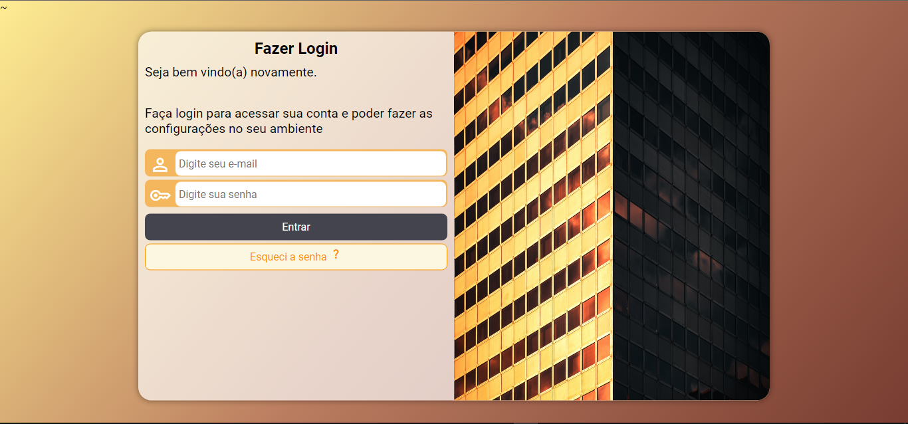

  

## 🖥️ Projeto 
Esse é um projeto Web Reponsivo de uma tela de Login.

## 🚀 Tecnologias 
Esse projeto foi desenvolvido com as aulas do Modulo 4 do curso em video.

- HTML
- CSS
- Git e Github
- Introdução a JS

